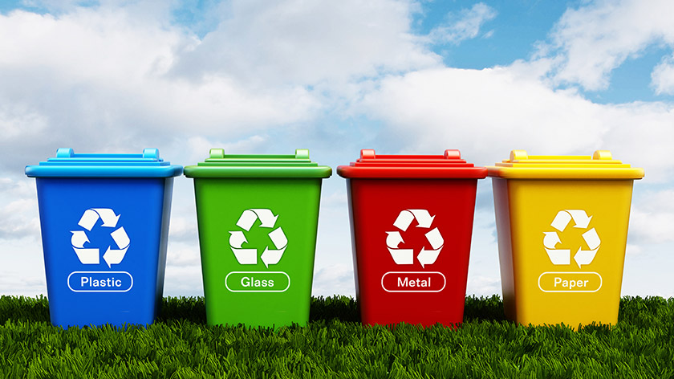
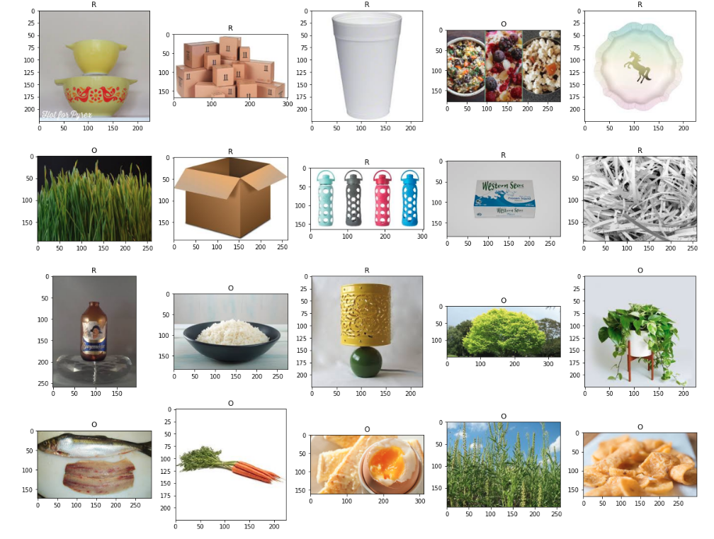

# Solid-Waste-Classification

<b> Introduction and Purpose </b>

In the recent times, I have started attaching so much importance to responsibly segregating solid waste. The necessity to segregate waste properly into recyclables and organics is very crucial for our planet. If all the waste ends up in landfills, those that cannot be decomposed will remain as a huge toxin affecting the surroundings and the living beings. 

I have started segregating recyclables, organics and hazardous materials into appropriate bins at my house and eventually dump them into their respective bins in common areas. But I have always had a feeling that the awareness of proper waste disposal still needs to improve. As a techie, I knew I could contribute something to ease the process of identifying a material as recyclable or organic. 

<b> The project and the dataset </b>

In this project, I have come up with an image classification model which classifies a given image into organic or recyclable item respectively. When I first embarked on this project, I wanted to collect my own data from my own phone and the internet. But I came across an amazing dataset on Kaggle for waste classification consisting of household waste. The dataset is divided into 22564 training images and 2513 test images for two classes each namely, Organic and Recyclable. Here's a sample of a mixture of images from both the classes from the training data.

Dataset: https://www.kaggle.com/techsash/waste-classification-data

<b> The Experiment, Observations and Results </b>

I have experimented using a basic Convolutional Neural Network as well as a Deep Convolutional Neural Network (VGG) to perform this classification task. The networks were built using Keras Neural Network Library. The classification accuracy is about 87.85% for the former network and 87.66% for the latter network. The basic CNN network was trained over 100 epochs and the VGG network was trained over 80 epochs. Both the networks were trained using an NVIDIA GeForce GTX 1070 GPU system and the training times were approximately about 45 minutes for the former and 2.6 hours for the latter networks respectively. 

<b> Future Work </b>

I hope to increase the classification accuracy even further by experimenting with fast.ai and other Deep Neural Networks. If I am able to achieve a considerable increase in the classification accuracy, I am interested in developing a user friendly smart phone app using this classification model which will help users to decide whether an item should be trashed or recycled, at the click of a picture :D
